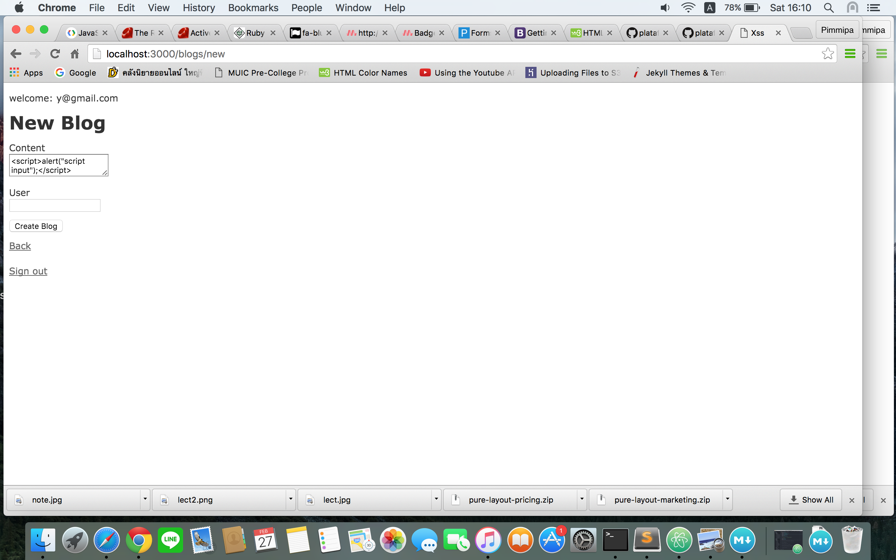
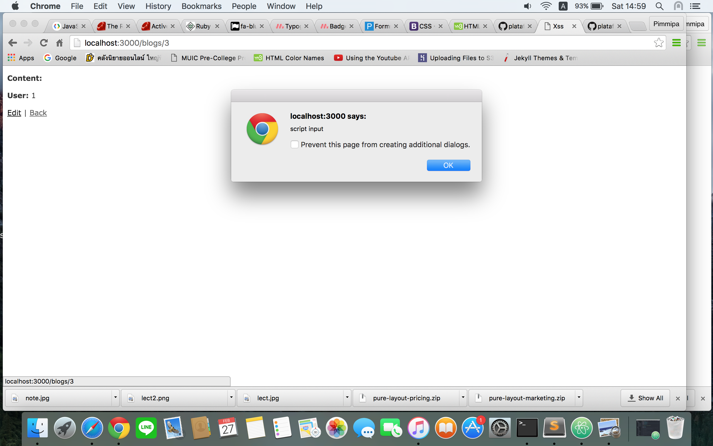
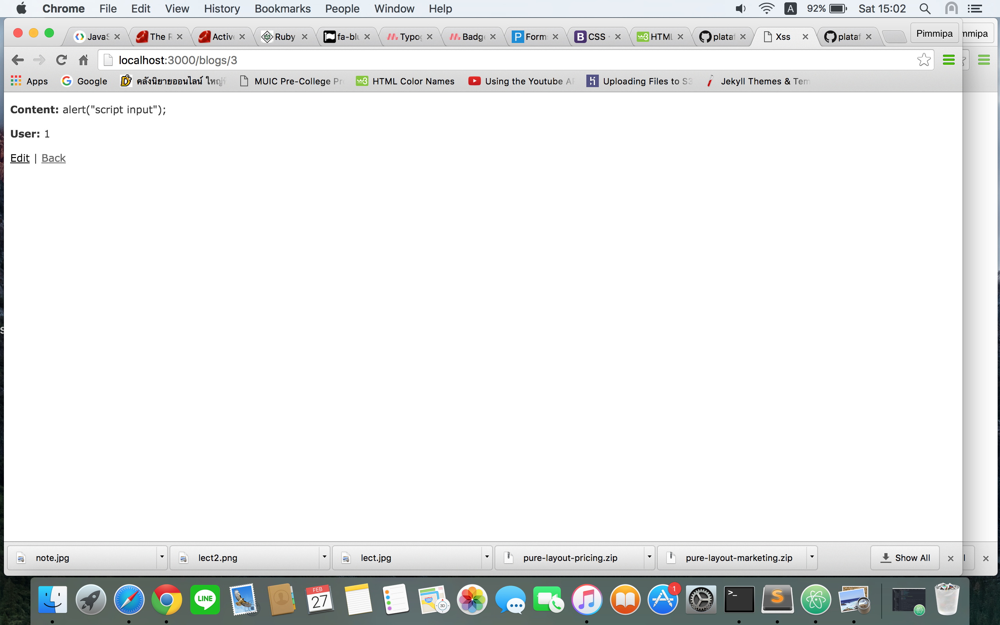

# README
For Cross-site scripting (XSS) Homework

## Step to create the project.

Create new Project in terminal

	rails new xss

Add gem into Gemfile.

```ruby
	source 'https://rubygems.org'
	gem 'rails', '4.2.5'
	gem 'sqlite3'
	gem 'sass-rails', '~> 5.0'
	gem 'uglifier', '>= 1.3.0'
	gem 'coffee-rails', '~> 4.1.0'
	gem 'jquery-rails'
	gem 'turbolinks'
	gem 'jbuilder', '~> 2.0'
	gem 'sdoc', '~> 0.4.0', group: :doc
	gem 'devise'  #<= Add this

	group :development, :test do
	  gem 'byebug'
	end

	group :development do
	  gem 'web-console', '~> 2.0'
	  gem 'annotate'   #<= Add this
	  gem 'spring'
	end
```

Run the bundle command to install all gem in terminal

	bundel install

#### Create login for project
Run the generator in terminal

	rails generate devise:install

Add Devise to your project using the generator in terminal

	rails generate devise User

Create a model called `Blog` in terminal

	rails g scaffold Blog content:text user:references

Create database by run this in terminal

	rake db:migrate

To make sure that when user enter the page, they will go to login page first is to add `before_action :authenticate_user!` into

* `app/controllers/application_controller.rb` file

```ruby
class ApplicationController < ActionController::Base
  protect_from_forgery with: :exception
  before_action :authenticate_user!  # add this
end
```

Then add root page for first enter website.

* `app/config/routes.rb` file

```ruby
Rails.application.routes.draw do
  resources :blogs
  devise_for :users
  root to: 'blogs#index' # add this
end
```

Make Sign Out link

* `app/views/layouts/application.html.erb` file

```ruby
<!DOCTYPE html>
<html>
<head>
  <title>Xss</title>
  <%= stylesheet_link_tag    'application', media: 'all', 'data-turbolinks-track' => true %>
  <%= javascript_include_tag 'application', 'data-turbolinks-track' => true %>
  <%= csrf_meta_tags %>
</head>
<body>

<% if user_signed_in? %>
  <p> welcome: <%= current_user.email%></p>
<% end %>

<%= yield %>

<br><br>
<% if user_signed_in? %>
  <%= link_to "Sign out", destroy_user_session_path, :method => :delete %>
<% end %>

</body>
</html>
```

Last is to run the project

	rails s


## Test

**Test** about rendering content as HTML instead of plain text by useing `raw`, `<%== %>`, `sanitize`, or `.html_safe`

First log in as one user then create a Blog post with content of `<script></script>` inside.



Then try tesing

***

#### raw

in `app/views/blogs/show.html.erb`

```ruby
<p id="notice"><%= notice %></p>

<p>
  <strong>Content:</strong>
  <%= raw @blog.content %>
</p>

<p>
  <strong>User:</strong>
  <%= @blog.user_id %>
</p>

<%= link_to 'Edit', edit_blog_path(@blog) %> |
<%= link_to 'Back', blogs_path %>
```
Then you will see this when view the blog


***

#### <%== %>

in `app/views/blogs/show.html.erb`

```ruby
<p id="notice"><%= notice %></p>

<p>
  <strong>Content:</strong>
  <%== @blog.content %>
</p>

<p>
  <strong>User:</strong>
  <%= @blog.user_id %>
</p>

<%= link_to 'Edit', edit_blog_path(@blog) %> |
<%= link_to 'Back', blogs_path %>
```
Then you will see this when view the blog



***

#### sanitize

in `app/views/blogs/show.html.erb`

```ruby
<p id="notice"><%= notice %></p>

<p>
  <strong>Content:</strong>
  <%= sanitize @blog.content %>
</p>

<p>
  <strong>User:</strong>
  <%= @blog.user_id %>
</p>

<%= link_to 'Edit', edit_blog_path(@blog) %> |
<%= link_to 'Back', blogs_path %>
```
Then you will see this when view the blog



***

#### .html_safe

in `app/views/blogs/show.html.erb`

```ruby
<p id="notice"><%= notice %></p>

<p>
  <strong>Content:</strong>
  <%= @blog.content.html_safe %>
</p>

<p>
  <strong>User:</strong>
  <%= @blog.user_id %>
</p>

<%= link_to 'Edit', edit_blog_path(@blog) %> |
<%= link_to 'Back', blogs_path %>
```
Then you will see this when view the blog


#### Which render function is the safest?

The answer is sanitize because is still consider the HTML input of the blog as a plain text but other 3 option isn't. This is because I write a script with an alert so if it compile as HTML, it will has an alert pop-up as show in the picture.
